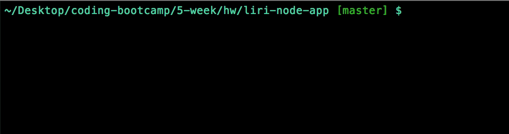

# Liri Node App

This is a command line app called Liri, similar to Alexa or Siri. Liri takes certain commands and gives you a response accordingly. 

## Getting Started

Download the repository and get cozy because for this app you'll need to install a few things.

### Prerequisites

* Node
* Twitter API Keys
* Spotify API Keys
* OMDB API Keys

Once you have your keys make a .env file and add them to this file. This file must be in a .gitignore folder if you intend on pushing to a Github Repository. It should look something like the following with actual keys in the placeholders.

```
# Spotify API keys

SPOTIFY_ID=your-spotify-id
SPOTIFY_SECRET=your-spotify-secret

# Twitter API keys

TWITTER_CONSUMER_KEY=your-twitter-consumer-key
TWITTER_CONSUMER_SECRET=your-twitter-consumer-secret
TWITTER_ACCESS_TOKEN_KEY=your-access-token-key
TWITTER_ACCESS_TOKEN_SECRET=your-twitter-access-token-secret

```

### Installing

You will need to install a few Node packages using Node Package Manager, or npm. The package.json file already has all of the depencencies indicating exactly what you need to install.

```
  "dependencies": {
    "dotenv": "^5.0.1",
    "inquirer": "^5.2.0",
    "node-spotify-api": "^1.0.7",
    "request": "^2.87.0", 
    "spotify": "^0.3.0",
    "twitter": "^1.7.1"
  }
```

a quick npm install will do the trick here

```
npm install
```

## Let's Call Liri
In your terminal go to the folder of this app and simply call on Liri



then go ahead and make the requests you'd like and enjoy the responses!


## Built With

* `JavaScript` - programming language
* `Node.js` - javascript runtime
* `Twitter` - NPM package
* `Node-Spotify-API` - NPM package
* `request` - NPM package
* `dotenv` - NPM package
* `inquirer` - NPM package


## Authors

* **Yumna Akhtar** - [Initial Work](https://github.com/PurpleBooth)

## License

This project is licensed under the MIT License - see the [LICENSE.md](LICENSE.md) file for details
